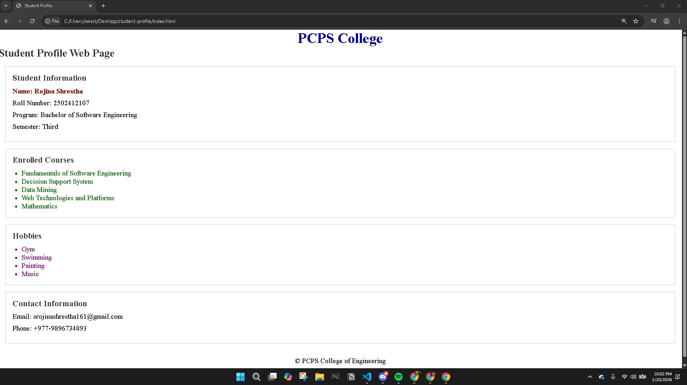
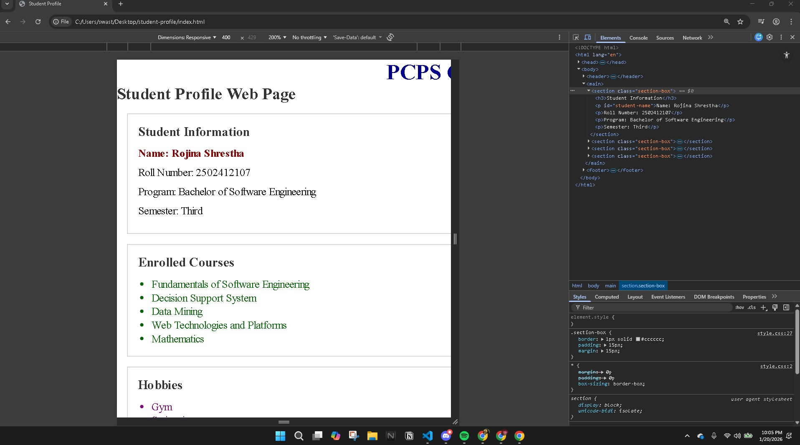
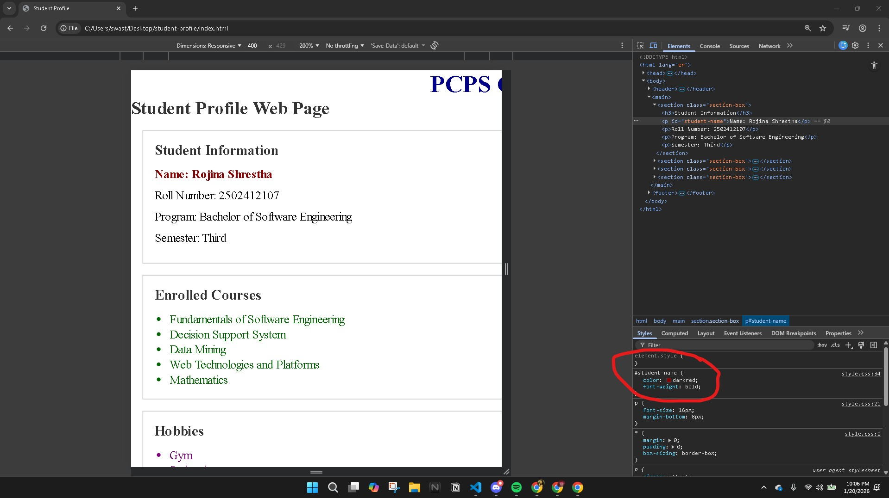

# Student Profile Web Page

## Lab Assignment – 02  
**Course:** Web Technologies and Platforms  
**Assignment Type:** Individual  

---

## Project Description
This project is a Student Profile Web Page created using HTML and external CSS.
It demonstrates the use of semantic HTML elements and different CSS selectors
including element, class, ID, group, descendant, and universal selectors.

---

## Technologies Used
- HTML5
- CSS3
- Google Chrome (for inspection)

---

## Folder Structure
student-profile
├── index.html
├── style.css
├── webpage-output.jpg
├── inspect-class.jpg
├── inspect-id.jpg

---

## Screenshots

### Web Page Output

### Inspect – Class Selector

### Inspect – ID Selector

---

## Author
**Name:** Rojina Shrestha  
**Program:** Bachelor of Software Engineering
